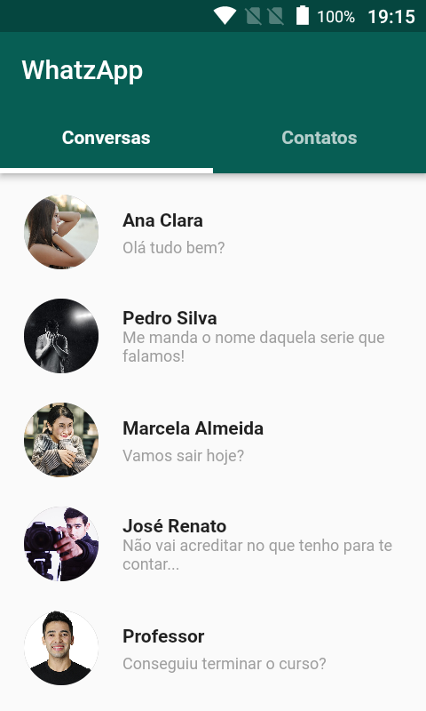
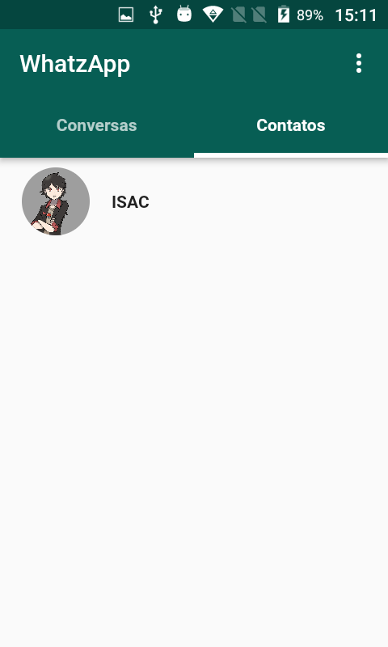
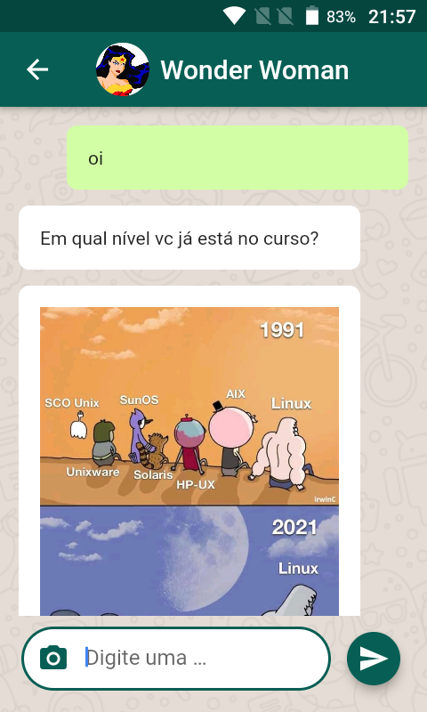
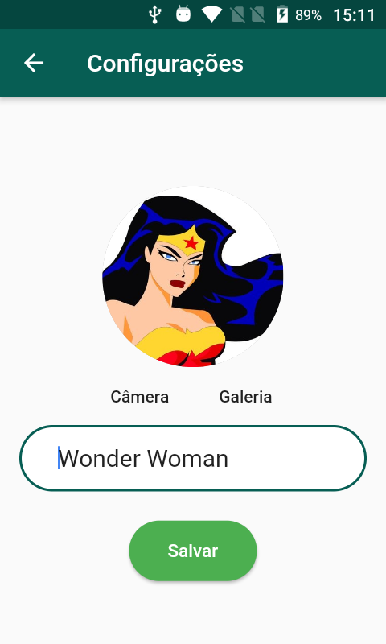

# Whatzapp

Projeto desenvolvido com a tecnologia Flutter durante o curso [Desenvolvimento Android e IOS com Flutter 2021](https://www.udemy.com/course/desenvolvimento-android-e-ios-com-flutter)

## Checklist da Aulas

- [x] Configurando o projeto
- [x] Criando interface de login
- [x] Criando interface de cadastro
- [x] Validando cadastro de usuário
- [x] Cadastro de usuário
- [x] Login de usuário
- [x] Salvando dados do usuário
- [x] Criando interface com abas
- [x] Listando conversas
- [x] Menu de opções - PopupMenuButton
- [x] Recursos de rotas - avançado
- [x] Criando tela de configurações
- [x] Fazendo upload da imagem do perfil
- [x] Atualizando dados do perfil
- [x] Listando contatos
- [x] Abrindo tela de mensagem
- [x] Criando interface de mensagem - parte 1
- [x] Criando interface de mensagem - parte 2
- [x] Salvando mensagem & ajuste na interface
- [x] Recuperando mensagens
- [x] Trocando mensagens
- [x] Enviando imagem na mensagem
- [x] Salvando conversa
- [x] Listando conversas
- [x] Ajustes & Definindo tema Android e IOS
- [x] Rolando mensagens automaticamente
- [x] Ordenando mensagens por data
- [x] WhatzApp Projeto Final

## Requisitos

|Technology|Version|
|----------|:----:|
|Flutter|1.22.5|
|Dart|2.10.4|
|Android SDK|29|

## Screenshots

## Downloads

[APK v1.0](https://github.com/tglima/whatzapp-clone/releases/download/v1.0/app-release.apk)