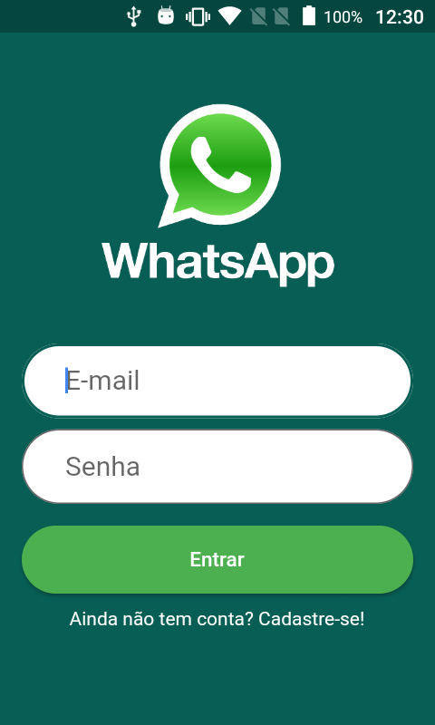
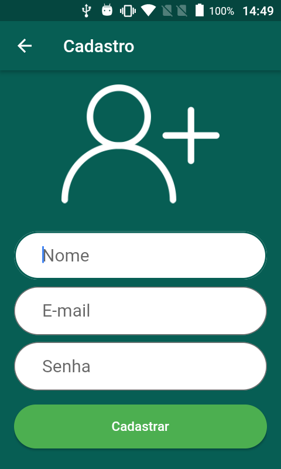

# Whatzapp

Projeto desenvolvido com a tecnologia Flutter durante o curso [Desenvolvimento Android e IOS com Flutter 2021](https://www.udemy.com/course/desenvolvimento-android-e-ios-com-flutter)

## Checklist da Aulas

- [x] Configurando o projeto
- [x] Criando interface de login
- [x] Criando interface de cadastro
- [x] Validando cadastro de usuário
- [x] Cadastro de usuário
- [x] Login de usuário
- [x] Salvando dados do usuário
- [x] Criando interface com abas
- [ ] Listando conversas
- [ ] Menu de opções - PopupMenuButton
- [ ] Recursos de rotas - avançado
- [ ] Criando tela de configurações
- [ ] Fazendo upload da imagem do perfil
- [ ] Atualizando dados do perfil
- [ ] Listando contatos
- [ ] Abrindo tela de mensagem
- [ ] Criando interface de mensagem - parte 1
- [ ] Criando interface de mensagem - parte 2
- [ ] Salvando mensagem & ajuste na interface
- [ ] Recuperando mensagens
- [ ] Trocando mensagens
- [ ] Enviando imagem na mensagem
- [ ] Salvando conversa
- [ ] Listando conversas
- [ ] Ajustes & Definindo tema Android e IOS
- [ ] Rolando mensagens automaticamente
- [ ] Ordenando mensagens por data
- [ ] WhatzApp Projeto Final

## Requisitos

|Technology|Version|
|----------|:----:|
|Flutter|1.22.5|
|Dart|2.10.4|
|Android SDK|=> 22 && <= 29|

## Screenshots

